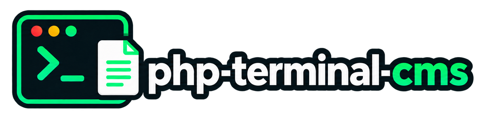

A micro publishing platform built on one idea: **a document is an ordered
sequence of typed lines**, not a blob of text.

Unix said everything is a file — which, as
[Linus Torvalds put it](https://yarchive.net/comp/linux/everything_is_file.html),
"really means everything is a stream of bytes": the point was never the
filename, it was that one small set of operations works whatever is on the
other end. Here, everything is a line, and the same bargain applies one level
up. A line carries a type, a position, and — for code and shell commands — a
dialect, and the same handful of operations moves, retypes, duplicates and
deletes every kind of them. You compose lines in a terminal-styled editor and
move them around with the keyboard; the result is an ordinary markdown file.

- [DEMO - Page](https://php-terminal-cms.linuxor.sk/)
- [DEMO - Editor](https://editor.linuxor.sk/)

![The two halves of php-terminal-cms, side by side. On the left the editor, a
static page holding a document as a list of typed lines — a heading, two
paragraphs, a list item, a php line and a bash line — which leaves as one
markdown file. In the middle that file is carried over by git, rsync, scp or
WinSCP, a copy you perform yourself, because the two halves never talk to each
other; or you skip the copy and edit the file on the server with any terminal
editor. On the right the published page, drawn by PHP on every request. Along
the bottom, where one request goes once it reaches PHP and which class does
what: the web server, then site/public/index.php, then routing — Router, Site,
Language and Listing comparing the URL with the category list and with the real
filenames, never building a path out of the request — then Document, Markdown,
Line, Renderer and Highlighter reading the file back into lines and out into
HTML, then Page wrapping that in the navigation, the language links and the
footer, and out as one response, with no file written, no socket opened and no
session started.](docs/media/architecture.svg)

Two halves that never talk to each other. The editor cannot write to the
server; the server cannot be written to from the internet. Publishing is a file
copy you perform with a tool that already has your credentials.

## What it is not

No database. No login. No session, cookie, form or upload. No admin panel. No
build step. No composer dependency, no npm package, no CDN, and not one byte of
third-party JavaScript. The published page runs no script of its own except one
short inline enhancement that adds a copy button, a theme toggle and a text-size
control — remove it and every page still reads perfectly.

## Quick start

```console
$ tar xzf php-terminal-cms-*.tar.gz && cd php-terminal-cms-*/
$ cp site/site.php.example site/site.php
$ php -S localhost:8080 -t site/public site/public/index.php
```

```output
[Wed Sep  9 19:44:02 2026] PHP 8.3.31 Development Server (http://localhost:8080) started
```

Open <http://localhost:8080> for the site, and `editor/index.html` — straight
from the filesystem, no server needed — to write.

A fresh installation is not empty: it ships with **about** and **guides**,
filled with example documents about php-terminal-cms itself. Delete them once
you have your own.

## The fourteen line types

| | type | key | dialects |
| --- | --- | --- | --- |
| `H1` `H2` `H3` | headings | `1` `2` `3` | — |
| `¶` | paragraph | `p` | — |
| `•` | list item | `l` | — |
| `"` | quote | `q` | — |
| `!` | note | `n` | — |
| `‖` | table row | `t` | — |
| `{}` | code | `c` | 58 languages — php js ts python ruby go rust java … |
| `$` | CLI | `s` | 17 shells and prompts — bash sh zsh fish powershell cmd … |
| `⟩` | output | `u` | — |
| `—` | rule | `r` | — |
| `⧉` | image | `f` | — |
| `@` | meta | `m` | — |

Consecutive lines of the same type form a **run** and render as one block — so a
code block, a list and a table are each just a run of lines, and `J`/`K` moves a
statement inside a block or a row inside a table.

A run of `output` lines after a code or CLI run becomes that block's **output
section**, folded by default in the editor, on the page, and in the exported
markdown.

Full reference: [docs/line-types.md](docs/line-types.md).

## Writing

The loop is `o` → type → `Enter` → type → `Enter`, never leaving the home row.
One keystroke restyles the current line; `D` removes it; `Tab` cycles the
dialect; `a` writes a link or captions an image; `E` exports.

```
j k ↓ ↑  cursor          i/Enter  edit in place      1 2 3   H1 H2 H3
g G      first/last      o O      new below/above    p l q n prose types
J K      move the line   D x      remove             t c s u table code cli out
drag ⠿   reorder         y        duplicate          r f m   rule figure meta
z        fold output     C        copy the block     Tab     cycle dialect
a        link / image    Tab ⇧Tab next / prev table cell
^K       link at caret   ^← ^→    move the table column
^Z ^⇧Z   undo / redo     N        new document       R       name the file
E        export          T        theme              :       command line
e v b    write/read/split         B  swap the panes  + - 0   content size
^B 1/2/3 write / read / split     ?  keys and commands
```

`a` opens the address overlay on the line under the cursor: the links already
in it, to pick between and edit as a **wording** and an **href**, or — on an
image line — its **src** and **caption**, the caption being the alt text too.
An href the published page would refuse to link is marked as such before you
publish it, by the same allowlist the page uses. `^K` while editing a line is
the same overlay from inside the box: what you selected becomes the wording and
the link replaces it where it stands, and with nothing selected the link lands
at the caret. `a` on a line you are not editing appends.

A table is a run of table rows and a row is one line, so `J`/`K` reorders a row
and `y` duplicates one. `Tab` while editing a row walks the caret from cell to
cell and, past the last one, opens the next row. In the write pane a table run
carries a strip above it, one entry per column showing its heading cell: click
an entry to select the column and `+` `×` `‹` `›` add, remove and move it —
`^←` and `^→` move it from the keyboard — and click a cell to open that row
with the caret already in it. `:col add`, `del`, `left` and `right` are the
same four from the command line, on a whole column across every row of the run.
There is no table object and no grid, which is
[ADR-0015](docs/adr/0015-tables-are-lines-not-a-grid.md).

The topbar has the three things that act on the document as a whole — **Open
.md**, **New .md**, **Clear** — and undo and redo beside them. Everything the
editor can do is also a command: `:` opens the command line, `Tab` completes it,
and `?` lists every command with what it does.

## Split screen

`b` puts the lines and the rendered page side by side, both live as you type;
`B` swaps which side each is on. `+` and `-` size the document in both panes
(and on the published page, next to the theme toggle), `0` returns it to 100%.
Both settings are remembered per browser.

Full reference: [docs/keymap.md](docs/keymap.md).

## Languages

A document's language is the suffix on its file name: `what-it-is.md` is the
site's own language and `what-it-is-sk.md` is the Slovak of the same document.
`site.php` says which language the site is written in and which others a file
name may end in:

```php
'lang'      => 'en',
'languages' => ['sk'],
```

The two files are one document. It is listed once, in the site's own language,
with the languages it exists in beside it — the one being read marked, the
others links:

```
2026-09-07  What php-terminal-cms is   about   (EN | SK)
```

Every document written before a second language existed keeps its name and its
address. Full reference: [docs/config.md](docs/config.md).

## On a phone or a tablet

Both halves are built for a touch screen as well as a keyboard. The published
page gives its navigation, listings and language links room for a finger, and
drops the tagline when there is no room for it.

The editor's legend along the bottom is the writing loop when there is no
keyboard to run it from: the line types on the left with `link` among them,
`edit` `new` `remove` `↑` `↓` `fold` on the right, each doing what the key
printed beside it does. Tap a line to put the cursor on it, tap it again to
write in it.

## Layout

The picture at the top says which half is which and what happens between them
— and, along its bottom row, where a request goes once it reaches PHP and which
class in `site/src` does what, which the tree cannot show. The tree says what
the files are.

```
README.md  LICENSE  VERSION  CONTEXT.md  CHANGELOG.md  AGENTS.md
docs/          line-types · keymap · format · config · deploy
               security · security-audit · adr/ · agents/ · media/
shared/        langs.json   theme.css          ← single sources
editor/        index.html  editor.js  ui.js    ← the static editor
site/
  public/      index.php  .htaccess  theme.css  site.css  media/
  src/         Router  Markdown  Renderer  Highlighter  Document  Line  Listing
               Language  Page  Site
  content/     <category>/<slug>.md   <slug>-<lang>.md
  site.php.example
bin/           build  test  fmt  package  manifest.php
tests/         js-dump.js  js-model.js  js-tables.js  js-inline.js  editor-probe.html
```

`site/site.php` — title, logo, favicon, tagline, languages, accent colour,
footer, the category list, which index pages list the documents below them, how
many the homepage lists, and whether a link that leaves the site opens in a new
tab — is the only file that differs between two installations. Copy it from
`site.php.example`; it is in neither the repository nor the package.

## Commands

| | |
| --- | --- |
| `php bin/build` | regenerate derived files from `shared/` |
| `php bin/test` | the whole suite — round trip, PHP/JS agreement, the editor's model, escaping, link targets, routing, listings, the footer, the page shell, the release manifest |
| `php bin/fmt` | rewrite `content/` into canonical form (`--check` to only report) |
| `php bin/package` | build `dist/php-terminal-cms-<version>.{tar.gz,zip}` |

Open `tests/editor-probe.html` in a browser to run the editor's DOM through the
writing loop — adding, removing, editing, folding, clicking away mid-edit — and
see pass/fail on the page. It is generated from `editor/index.html`, so it
always drives the page the editor actually is.

`bin/build` exists because three files are derived: `editor/langs.js` (the editor
must work from `file://`, where `fetch()` is blocked), the two copies of
`theme.css`, and the probe page above. `bin/test` fails if any has drifted from
its source.

## Requirements

PHP 8.1 or newer for the site — nothing else. The editor needs a browser. Node
is optional and used only by `bin/test`, to check that the JavaScript and PHP
halves agree.

## Documentation

- [line-types.md](docs/line-types.md) — every type, what it emits
- [keymap.md](docs/keymap.md) — every key and `:` command
- [format.md](docs/format.md) — the markdown contract and its limits
- [config.md](docs/config.md) — `site.php`
- [deploy.md](docs/deploy.md) — installing both halves, upgrading, publishing
- [security.md](docs/security.md) — what a deployment exposes, and what it does not
- [security-audit.md](docs/security-audit.md) — what the reviews looked at and found
- [CHANGELOG.md](CHANGELOG.md) — what changed in each release
- [adr/](docs/adr/) — why it is built this way
- [CONTEXT.md](CONTEXT.md) — the vocabulary

## Licence

MIT.
